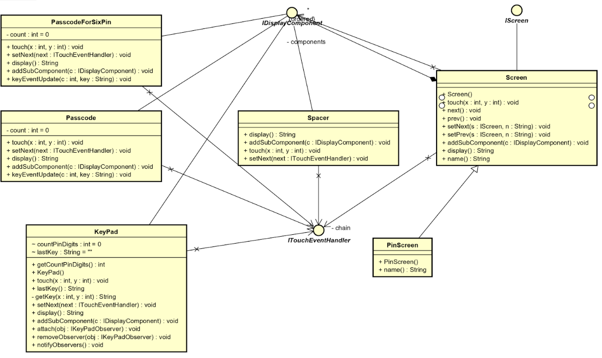

# Starbucks Project

**Adding a New Cards**

*Pattern used: Observer Pattern, Composite Pattern, Chain of Responsibility Pattern*

Description:

The composite pattern was used for design the functionality of adding a new card. The class diagram is shown below

According the composite pattern, IDisplayComponent is the interface, implemented by leaf, which are CardCode, CardID, and KeyPad class, and the composite which is AddCard class. Inside the AddCard class, CardID, CardCode and KeyPad will be added using function addSubComponent(). Once those elements are added, AddCard will display the content from display() function of its leaves. The touch() function inside CardID and CardCode will handle adding digits into the existing cardID or cardCode, which sets the display() of their own. Once the user want to touch to switch between CardCode and CardID, the touch() function also gets the value and use the methods inside of CardFocus class. Chain of responsibility is also used here, so touch() is taking different number and pass the variable into the next handle class if the current touch does not match the condition. CardFocus class holds the flag which can determine its either the cardID entry is selected or cardcode entry is selected. 
For better explanation of the process of adding a new card, the sequence diagrams are shown below.

The first sequence diagram shows the steps from main to setting screen.

This sequence diagram shows the flow from touching inside of setting menu to the addcard screen. It starts from main() when the user calls touch() function. The function gets transferred from devices all the way to setting under the support of Command Pattern design. Once the touch() function gets called inside Setting class, it will authorize if the touch() is the correct command calling for adding a new card, which was implemented inside the touch function. Once the touch() is triggered in the Setting class. It will drive back to Device go through the same process until it reaches Frame class. Since it executed the command under Command Pattern design, addcard display() will be called and the user can type in the cardID and cardCode from there. 

This sequence shows the process after the user types in the correct cardcode ,cardID and press the next button. Since addcard class will handle the touch() for user input, the next() function will be called once user press next button. It first checks if the cardID is 9 digits and the cardcode is 3 digits, then it will pass the current cardID entry into the Cards class which contains CardID, CardCode strings as its private variables. It also sets the current balance to be $20 as what it is required in the user case.  After the variables inside Cards are set, the resetCard() will be called to clear the current cardID and cardCode entry while setting the flags inside CardFocus to be original (select cardID entry since it was selected as default). If the cardID and cardCode do not contains the correct char number, calling next() will directly call resetCard() and reset each entry including the flag. Assuming the user has the correct ID and code, the next() will execute command under the support of Command pattern to direct the current screen into MyCards(). MyCards.display() will return the card balance which will be $20.

**Centering and Landscape Support**

*Pattern Used: Decorator Pattern, Strategy Pattern*

Description:

For centering and supporting landscape, decorator pattern design was implemented in this project. The class diagram is shown below.

Class Decorator implements IScreen, having screen as the concreteComponent since the screen is implemented from IScreen and the purpose of using this pattern is centering display() from different classes. CenterDecorator is a class extended from Decorator, having the detailed function called addBehavior, which takes display() as an input and uses padSpacces() as a helper function in order to center the screen content. LeftDecorator will do left align for the screen content, and it is also another concreteDecorator class. The reason on using Decorator design pattern was that centering need to add different amounts of space in between the string returned from display() in different classes, and they use the same method with different implementations. The Decorator was also checking the current strategy, and it will do different types of centering under different mode since the screen width and length are different under two modes. 

The Strategy pattern was implemented for landscape mode and also the portrait mode since the screen layout is different. ConcreteStrategies are implemented inside Frame class such as display and screen content. There are two kinds of functions as strategies for portrait and landscape mode. Since only MyCards and MyCardsPay screen support landscape mode, there are many empty functions declared under landscape portion. 

**4-Pin and 6-Pin Mode**

*Pattern Used: Observer Pattern, Chain of Responsibility Pattern, Composite Pattern, State Pattern*

Observer pattern, Component pattern and chain of responsibility pattern can be used to implement the logging using 4 pin or 6 pin. PasscodeForSixPin is another class which is similar to passcode. The difference is that the display() of PasscodeForSixPin has 6 pin entries. It works the same way as Passcode class when it becomes the observer on KeyPad. Under the device class, according to the length of the pin passing into getNewinstance() function, it will determine it is either 6-pin mode or 4-pin mode. Once the KeyPad has a pin entered, it will notify the observer which are PassCodeForSixPin/Passcode, and PinEntryMachine.
Since 6-pin mode require additional states, so we have two more states need to be implemented: FivePinState and SixPinState. Those states set their next state and determine the state to verify the passcode, which will also notify the device if the passcode is authorized or not. 
Chain of Responsibility pattern and Composite pattern can also be applied here since passcode for either 6-pin or 4-pin are composited inside PinScreen as display methods. Touch event are also taken here for different components, chaining together using chain of responsibility pattern since different components have their own touch events. 

The diagram above is the class diagram for state pattern. PinEntryMachine sets the contexts, then IPinState becomes the interface of states which has been implemented for six states. Those state will also affect the passcode display since different state will have different pincount and set different 

Besides those design patterns, singleton pattern is implemented for Device and Cards classes, since there is only one card can be added to the system under only one device. Proxy pattern is used for auth event, but the device can also get auth information from observer pattern. 
